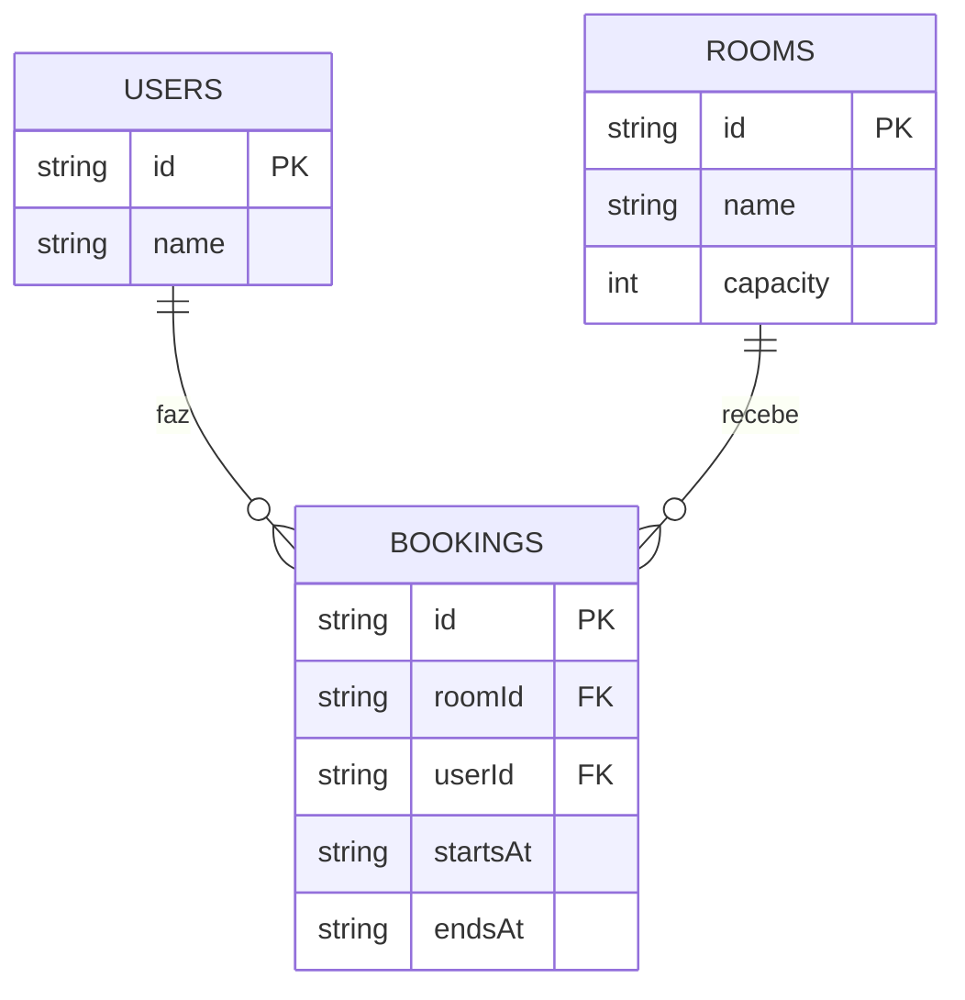

# 🛠️ Software Design Document (SDD)

**Projeto:** [Nome do Projeto]
**Versão:** 1.0.0
**Última atualização:** [AAAA-MM-DD]

> 🧹 **Antes de entregar:** apague as linhas marcadas com `Ex:` — são de um
> domínio fictício (reserva de salas de estudo), não do seu projeto.
>
> 🤖 **O `prd.md` responde *o quê* o produto faz. Este responde *onde as coisas
> moram e como se chamam*.** Detalhe de tela — rota, componente, contrato —
> **não** se decide aqui: isso é trabalho da spec de cada história.

---

## 🤖 1. Fontes de Contexto para a IA

> Onde a IDE agêntica busca a verdade. **Isto é o índice; a configuração mora
> nos arquivos** — documento não configura ferramenta.

| Fonte | Onde configurar | Serve para |
| :--- | :--- | :--- |
| Regras do agente | `AGENTS.md` na raiz | Mandar a IA ler o PRD e o SDD antes de escrever código |
| Design (Figma/Stitch) | `[LINK DO ARQUIVO]` | Cores, tipografia, hierarquia visual |
| GitHub MCP | `.mcp.json` | Ler as Issues do Kanban |

### 📌 1.1. O arquivo `AGENTS.md` (obrigatório, na raiz)

**Sem ele, nada desta pasta é lido.** Conteúdo mínimo — copie:

```markdown
# Instruções para agentes de IA

Antes de escrever código, leia `docs/prd.md` e `docs/architecture.md`.

- Não invente regra de negócio: se não está no PRD, pergunte.
- Nomes de entidade seguem o Glossário Técnico (architecture.md §5.1).
- O backend atual é json-server. NÃO gere código de Supabase, Firebase
  ou de qualquer banco: os dados vêm de `HttpClient` contra `localhost:3000`.
- Nenhum componente chama `HttpClient`. Acesso a dados só via repository
  (architecture.md §4.2).
- Toda tela que busca dados trata carregando, vazio e erro (PRD RNF04).
```

---

## 📦 2. Stack Tecnológica

> Definição **estrita**: nenhuma dependência entra sem aparecer aqui. Esta
> seção e o `package.json` contam a mesma história, ou o projeto já se perdeu.

* **Frontend:** Angular 21+ · **zoneless** (padrão do v21) · componentes
  standalone (padrão — não se escreve `standalone: true`) · signals para estado.
* **Padrões de código exigidos:**
  * `@if` / `@for` / `@switch` — **não** `*ngIf` / `*ngFor`.
  * `input()` / `output()` como funções — **não** `@Input()` / `@Output()`.
  * `inject()` — **não** injeção por construtor.
  * Lazy loading por rota de feature.
* **Estilo:** Tailwind CSS [+ Spartan UI, + Lucide — se o projeto usar].
* **Dados (provisório):** json-server — ver §2.1.
* **Utilitários:** [Ex: `date-fns`].

### ⚠️ 2.1. A fonte de dados atual é provisória — e isso está declarado

O backend real (Supabase) entra no fim da disciplina. Até lá, os dados vêm de
**json-server**: um arquivo JSON servido como API REST.

**Assume que** — mentiras que o projeto aceita **por enquanto**:

| O que fingimos | A verdade | Issue para trocar |
| :--- | :--- | :--- |
| Existe autenticação | Não existe. Qualquer um acessa qualquer rota | `#[NN]` |
| Cada registro tem dono | Não tem. Qualquer um edita e apaga tudo | `#[NN]` |
| O servidor valida os dados | Não valida. json-server aceita qualquer JSON | `#[NN]` |

> 🚨 **Mentira provisória só existe declarada.** Ela precisa das três coisas:
> estar nesta tabela, ter Issue própria, e ter um `// TODO #NN` no código
> apontando para a Issue. Sem as três ela não some — reaparece no dia da
> apresentação.

**Como rodar:** `npx json-server apps/api/db.json --port 3000`

---

## 🗂️ 3. Estrutura do Repositório (Monorepo)

### Por que um repositório só

O projeto tem duas aplicações — o frontend e o backend — e elas vivem **no mesmo
repositório**. Não é preguiça de criar o segundo: é decisão.

Com dois repositórios, uma mudança que toca a tela **e** o formato dos dados
vira dois PRs, em dois lugares, revisados por pessoas diferentes e mesclados
fora de ordem — e a produção quebra no intervalo. Com um repositório, a mudança
inteira é **um commit**: dá para ver o antes e o depois de uma vez, e reverter
de uma vez.

E há a razão que importa nesta disciplina: **a IA lê um repositório por vez.**
Com o front e o back separados, o agente nunca enxerga o contrato completo — ele
vê metade e inventa a outra.

> 📌 **Monorepo ≠ ferramenta.** Aqui é a forma simples: uma pasta por aplicação,
> cada uma com o seu `package.json`. Nada de npm workspaces, Nx ou Turborepo
> enquanto não houver código compartilhado de verdade — ferramenta sem problema
> para resolver é só custo.

### A árvore

```
.
├── AGENTS.md              # regras para a IA (§1.1)
├── README.md              # a vitrine: o que é e como rodar
├── package.json           # só atalhos para as duas apps
├── docs/
│   ├── prd.md             # o QUE o produto faz
│   └── architecture.md    # este arquivo
└── apps/
    ├── web/               # Angular  (§4)
    └── api/               # json-server hoje; Supabase depois
        └── db.json
```

**Atalhos na raiz** (`package.json`), para ninguém precisar decorar caminho:

```json
{
  "scripts": {
    "start": "npm --prefix apps/web start",
    "api": "json-server apps/api/db.json --port 3000"
  }
}
```

Precisa de **dois terminais**: `npm run api` e `npm start`.

> 🔮 **Quando o Supabase entrar**, `apps/api/` deixa de servir JSON e passa a
> hospedar as migrations e as Edge Functions. **A pasta não muda de lugar, nem
> o repositório se divide** — muda só o que tem dentro. É exatamente por isso
> que ela já existe hoje.

---

## 🏗️ 4. Arquitetura Frontend (`apps/web/src/app/`)

### 🧩 4.1. Feature-Driven

O código é organizado por **domínio de negócio**, não por tipo de arquivo.

* **`core/`** — a fundação. Roda uma vez só (singletons): guards, interceptors,
  configuração, repositories de dados.
* **`shared/`** — a caixa de ferramentas. Componentes "burros" (botão, input,
  card), pipes e diretivas que qualquer feature usa.
* **`features/`** — o coração do negócio. **Uma pasta por domínio**, e cada
  domínio nasce de uma User Story do PRD.

Dentro de uma feature:

```
features/booking/
├── pages/          # telas ligadas a rota
├── components/     # pedaços de tela só desta feature
└── models/         # tipos só desta feature
```

> 📏 **Regra de dependência (a IA precisa saber disto):**
> `features/` importa de `core/` e `shared/`. `shared/` **não** importa de
> `features/`. Uma feature **não** importa de outra — se as duas precisam da
> mesma coisa, ela sobe para `shared/`.

> ⛏️ **Pasta se cria quando a história é implementada**, não agora. Estrutura
> vazia é ruído: a IA lê como se fosse código que existe.

### 🔌 4.2. A regra que mais importa: componente não fala com o servidor

> **Nenhum componente usa `HttpClient` diretamente. Todo acesso a dados passa
> por um *repository* em `core/data/`.**

```ts
// core/data/bookings.repository.ts
@Injectable({ providedIn: 'root' })
export class BookingsRepository {
  private http = inject(HttpClient);
  private url = `${environment.apiUrl}/bookings`;

  list() { return this.http.get<Booking[]>(this.url); }
  create(input: NewBooking) { return this.http.post<Booking>(this.url, input); }
}
```

**Por que isso paga:** no fim do semestre, trocar json-server por Supabase mexe
**só nestes arquivos** — uma tela sequer é reescrita. Se o `HttpClient` estiver
espalhado pelos componentes, a troca vira reescrever o projeto inteiro.

Essa é a única decisão de arquitetura desta atividade que você vai **sentir**
mais tarde. As outras são organização; esta é dinheiro no banco.

### 🌐 4.3. Onde fica o endereço da API

O Angular **não tem `.env` em runtime**: `environment.ts` é compilado dentro do
bundle e é **público**. Hoje ele guarda só a URL da API:

```ts
// environments/environment.ts
export const environment = { apiUrl: 'http://localhost:3000' };
```

> 🔒 **Regra permanente:** segredo nenhum entra em `environment.ts`. Nunca.
> Qualquer pessoa abre o DevTools e lê.

---

## 🗄️ 5. Arquitetura de Dados

### 📖 5.1. Glossário Técnico (Mapeamento)

> A ponte entre o português do negócio (PRD §2) e o inglês do código.
> **Decisão do projeto: dados e código em inglês, interface em português.**
> Meio a meio é o que produz `grupoSorteioList` e `participantesData`.

| Termo PRD (PT-BR) | Entidade técnica (EN) | Atributos principais |
| :--- | :--- | :--- |
| Ex: Sala | `rooms` | `id`, `name`, `capacity` |
| Ex: Reserva | `bookings` | `id`, `roomId`, `userId`, `startsAt`, `endsAt` |

### 📊 5.2. Diagrama ER (Mermaid)



### 🗃️ 5.3. Onde mora o formato dos dados

Hoje: **`apps/api/db.json`**, versionado no Git. Cada chave do topo é uma
coleção e vira uma rota REST automática (`bookings` → `/bookings`).

```json
{
  "rooms":    [{ "id": "r1", "name": "Sala A", "capacity": 6 }],
  "bookings": [{ "id": "b1", "roomId": "r1", "userId": "u1",
                 "startsAt": "2026-03-10T14:00", "endsAt": "2026-03-10T16:00" }]
}
```

> ⚠️ **Cuidado:** json-server **escreve no arquivo**. Um POST feito enquanto você
> testa altera o `db.json` e aparece no `git diff`. Confira antes de commitar —
> e mantenha um punhado de dados de exemplo, não o lixo dos seus testes.

---

## 🗺️ 6. Mapa de Domínios e Rotas

> **Este índice cresce.** Ele **não** é para preencher com o projeto inteiro
> agora: história sem spec aprovada aqui é chute, e vai contradizer a spec
> quando ela existir.
>
> **Preencha uma linha por história implementada** — a spec é que define rota,
> componente e contrato de dados. Aqui fica só o mapa de quem já existe.

| Domínio | Rota | Page Component | Guard | Dados | US |
| :--- | :--- | :--- | :--- | :--- | :--- |
| Ex: `booking` | `/reservas` | `booking/pages/list/list.page.ts` | — | `BookingsRepository.list()` | US02 |

> 🔮 A coluna **Guard** fica vazia até a aula de autenticação — hoje não há
> login (§2.1). A coluna **Dados** cita o *repository*, nunca a URL nem SQL:
> assim ela continua verdadeira depois da troca de backend.

---

## 📅 7. Histórico

| Data | Versão | O que mudou |
| :--- | :--- | :--- |
| Ex: 2026-03-10 | 1.0.0 | Versão inicial: monorepo, feature-driven, json-server |

---

## 🛑 O que ainda **não** está neste documento

Banco de dados real, autenticação, permissões e segurança entram no fim da
disciplina, num segundo documento (`architecture-supabase.md`).
