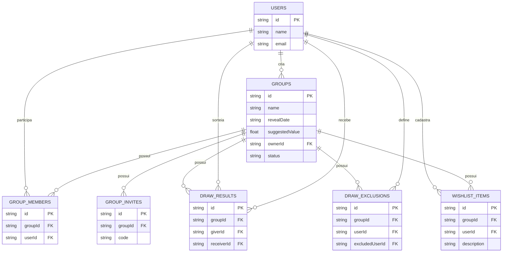

# 🛠️ Software Design Document (SDD)

**Projeto:** Revela
**Versão:** 1.0.0
**Última atualização:** 2026-08-26

> 🤖 O `prd.md` responde **o que** o produto faz. Este documento responde **onde as coisas moram e como se chamam**.
>
> Detalhes específicos de tela, rotas, componentes e contratos de cada funcionalidade serão definidos nas respectivas especificações `.spec.md`.

---

## 🤖 1. Fontes de Contexto para a IA

> Onde a IDE agêntica busca a verdade. Este documento funciona como índice; as configurações reais ficam nos arquivos correspondentes.

| Fonte                 | Onde configurar                   | Serve para                                                    |
| :-------------------- | :-------------------------------- | :------------------------------------------------------------ |
| Regras do agente      | `AGENTS.md` na raiz               | Orientar a IA a ler o PRD e o SDD antes de escrever código    |
| Design (Figma/Stitch) | Link público do arquivo de design | Cores, tipografia, componentes e hierarquia visual            |
| GitHub MCP            | `.mcp.json`                       | Permitir que a IA consulte as Issues e informações do projeto |

### 📌 1.1. O arquivo `AGENTS.md`

O arquivo `AGENTS.md` será obrigatório na raiz do repositório.

Conteúdo mínimo:

```markdown
# Instruções para agentes de IA

Antes de escrever código, leia `docs/prd.md` e `docs/architecture.md`.

- Não invente regra de negócio: se não está no PRD, pergunte.
- Nomes de entidade seguem o Glossário Técnico em `architecture.md` §5.1.
- O backend atual é json-server. NÃO gere código de Supabase, Firebase ou outro banco real nesta etapa.
- Os dados provisórios são acessados por repositories em `core/data/`.
- Nenhum componente chama `HttpClient` diretamente.
- Toda tela que busca dados trata os estados de carregamento, vazio e erro.
- Respeite os padrões modernos de Angular definidos neste documento.
```

---

## 📦 2. Stack Tecnológica

> A stack deve permanecer alinhada ao `package.json`. Nenhuma dependência adicional deve ser introduzida sem necessidade e sem estar documentada.

**Frontend:**

* Angular 21+
* Arquitetura Standalone
* Zoneless
* Signals para gerenciamento de estado
* `@if`, `@for` e `@switch` para fluxo de controle
* `input()` e `output()` para comunicação entre componentes
* `inject()` para injeção de dependências
* Lazy loading por rota de feature

**Estilo:**

* Tailwind CSS
* Lucide, caso seja utilizado no projeto

**Dados provisórios:**

* json-server

**Backend futuro:**

* Supabase, a ser incorporado posteriormente na disciplina

---

### ⚠️ 2.1. Fonte de dados provisória

Durante esta etapa, o backend real ainda não está implementado. Os dados serão simulados utilizando `json-server`, servido como uma API REST local.

**Comando para execução:**

```bash
npx json-server apps/api/db.json --port 3000
```

### Limitações provisórias

| O que fingimos                      | A verdade atual                                                 | Issue para substituir |
| :---------------------------------- | :-------------------------------------------------------------- | :-------------------- |
| Existe autenticação                 | Não existe autenticação real no json-server.                    | A definir             |
| Cada registro possui um dono        | O json-server não aplica controle de propriedade ou permissões. | A definir             |
| O servidor valida regras de negócio | O json-server não aplica as regras de negócio do Revela.        | A definir             |

> Essas limitações são provisórias e deverão ser substituídas quando o Supabase e a autenticação forem implementados.

---

## 🗂️ 3. Estrutura do Repositório

O projeto utiliza um monorepo para manter frontend e backend provisório no mesmo repositório.

### Estrutura

```text
.
├── AGENTS.md
├── README.md
├── package.json
├── docs/
│   ├── prd.md
│   └── architecture.md
└── apps/
    ├── web/
    └── api/
        └── db.json
```

### Atalhos na raiz

O `package.json` da raiz deverá disponibilizar atalhos para execução das aplicações:

```json
{
  "scripts": {
    "start": "npm --prefix apps/web start",
    "api": "json-server apps/api/db.json --port 3000"
  }
}
```

A execução local utiliza dois terminais:

```bash
npm run api
```

e:

```bash
npm start
```

Quando o Supabase for incorporado, a estrutura de `apps/api/` poderá ser adaptada para conter as configurações, migrations e Edge Functions necessárias.

---

## 🏗️ 4. Arquitetura Frontend

O código frontend ficará em:

```text
apps/web/src/app/
```

A organização seguirá uma abordagem orientada a funcionalidades e domínios de negócio.

### 🧩 4.1. Feature-Driven

```text
core/
```

Contém elementos utilizados globalmente pela aplicação, como:

* configuração;
* repositories;
* serviços globais;
* guards;
* interceptors.

```text
shared/
```

Contém elementos reutilizáveis e independentes de domínio, como:

* componentes visuais;
* pipes;
* diretivas;
* elementos de interface.

```text
features/
```

Contém as funcionalidades do Revela organizadas por domínio.

Exemplo:

```text
features/groups/
├── pages/
├── components/
└── models/
```

As features serão criadas conforme suas respectivas User Stories forem implementadas.

### 📏 Regra de dependência

* `features/` pode importar de `core/` e `shared/`.
* `shared/` não importa de `features/`.
* Uma feature não deve importar diretamente outra feature.
* Caso duas features precisem do mesmo recurso específico e reutilizável, ele deve ser avaliado para inclusão em `shared/` ou `core/`.

---

### 🔌 4.2. Acesso aos dados

Nenhum componente deve utilizar `HttpClient` diretamente.

O acesso aos dados deve ser realizado exclusivamente por repositories localizados em:

```text
core/data/
```

Exemplo:

```ts
@Injectable({ providedIn: 'root' })
export class GroupsRepository {
  private http = inject(HttpClient);
  private url = `${environment.apiUrl}/groups`;

  list() {
    return this.http.get<Group[]>(this.url);
  }

  create(input: NewGroup) {
    return this.http.post<Group>(this.url, input);
  }
}
```

Essa separação permite substituir o json-server pelo Supabase posteriormente sem espalhar detalhes de acesso aos dados pelos componentes da aplicação.

---

### 🌐 4.3. Endereço da API

O endereço da API será definido no arquivo de ambiente do Angular:

```ts
export const environment = {
  apiUrl: 'http://localhost:3000'
};
```

O arquivo de ambiente é público após o build da aplicação.

> 🔒 Nenhum segredo, senha, chave privada ou credencial deve ser armazenado em `environment.ts`.

---

## 🗄️ 5. Arquitetura de Dados

### 📖 5.1. Glossário Técnico

Os termos do negócio definidos no PRD serão mapeados para entidades técnicas em inglês.

| Termo PRD                | Entidade técnica | Atributos principais                                              |
| :----------------------- | :--------------- | :---------------------------------------------------------------- |
| Usuário                  | `User`           | `id`, `name`, `email`                                             |
| Grupo                    | `Group`          | `id`, `name`, `revealDate`, `suggestedValue`, `ownerId`, `status` |
| Participante             | `GroupMember`    | `id`, `groupId`, `userId`                                         |
| Convite                  | `GroupInvite`    | `id`, `groupId`, `code`                                           |
| Sorteio/Resultado        | `DrawResult`     | `id`, `groupId`, `giverId`, `receiverId`                          |
| Exclusão                 | `DrawExclusion`  | `id`, `groupId`, `userId`, `excludedUserId`                       |
| Item da Lista de Desejos | `WishlistItem`   | `id`, `groupId`, `userId`, `description`                          |

> A senha não faz parte da entidade `User` permanente. Quando a autenticação real for implementada, o gerenciamento de credenciais será responsabilidade do serviço de autenticação.

---

### 📊 5.2. Diagrama ER



---

### 🗃️ 5.3. Onde mora o formato dos dados

Durante a fase provisória, o formato dos dados será armazenado em:

```text
apps/api/db.json
```

Cada chave de primeiro nível representa uma coleção e gera uma rota REST correspondente no `json-server`.

Exemplo:

```json
{
  "users": [],
  "groups": [],
  "groupMembers": [],
  "groupInvites": [],
  "drawResults": [],
  "drawExclusions": [],
  "wishlistItems": []
}
```

> ⚠️ O `json-server` pode alterar o arquivo `db.json` durante operações de escrita. Antes de realizar um commit, verificar se alterações realizadas durante testes não foram incluídas acidentalmente.

---

## 🗺️ 6. Mapa de Domínios e Rotas

Este mapa será preenchido conforme as funcionalidades forem implementadas.

A especificação `.spec.md` de cada User Story será responsável por definir os detalhes da implementação.

| Domínio | Rota | Page Component | Guard | Dados | US |
| :------ | :--- | :------------- | :---- | :---- | :- |
| —       | —    | —              | —     | —     | —  |

> A coluna `Guard` será preenchida quando a autenticação e os controles de acesso forem implementados.
>
> A coluna `Dados` deve referenciar repositories, nunca URLs ou consultas SQL diretamente.

---

## 📅 7. Histórico

| Data       | Versão | O que mudou                                  |
| :--------- | :----- | :------------------------------------------- |
| 2026-08-26 | 1.0.0  | Versão inicial do SDD para o projeto Revela. |

---

## 🛑 O que ainda não está neste documento

A implementação do banco de dados real, autenticação, gerenciamento de sessão, permissões e políticas de segurança será realizada posteriormente, quando o Supabase for incorporado ao projeto.

Essas decisões serão documentadas e detalhadas em uma versão posterior da arquitetura.
